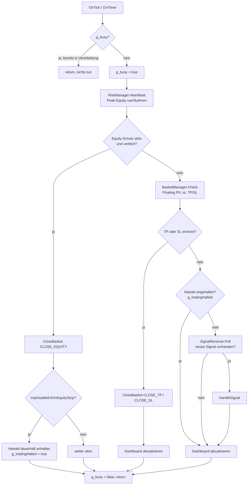
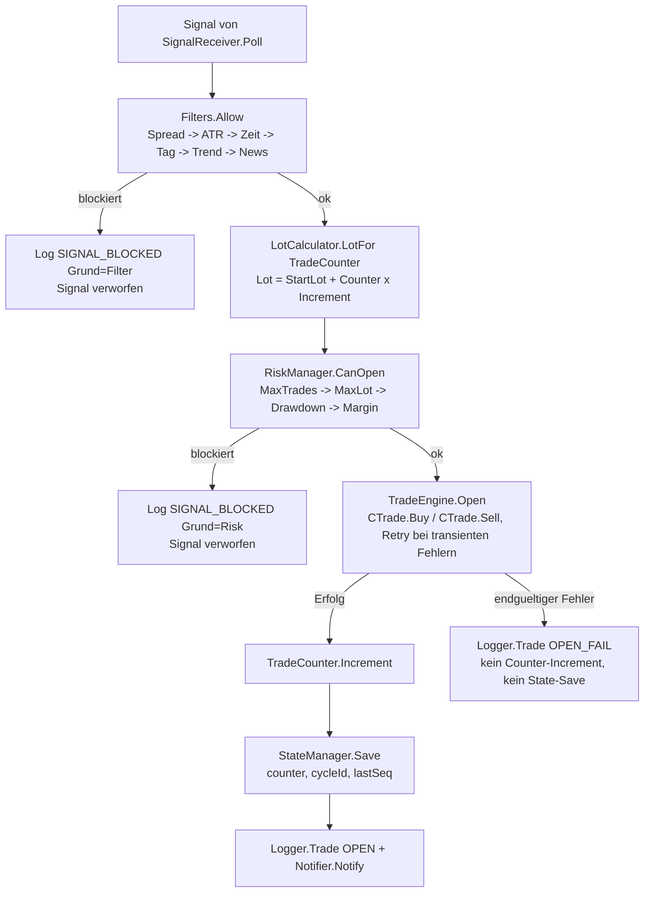
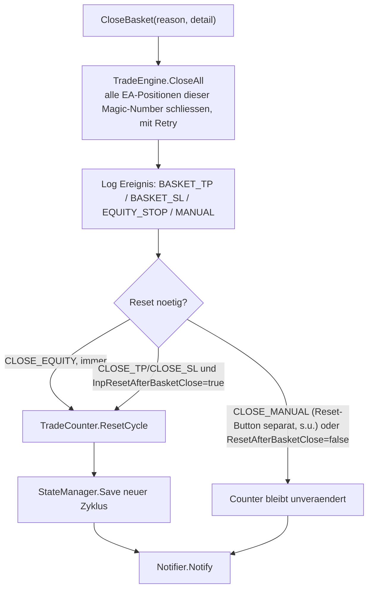
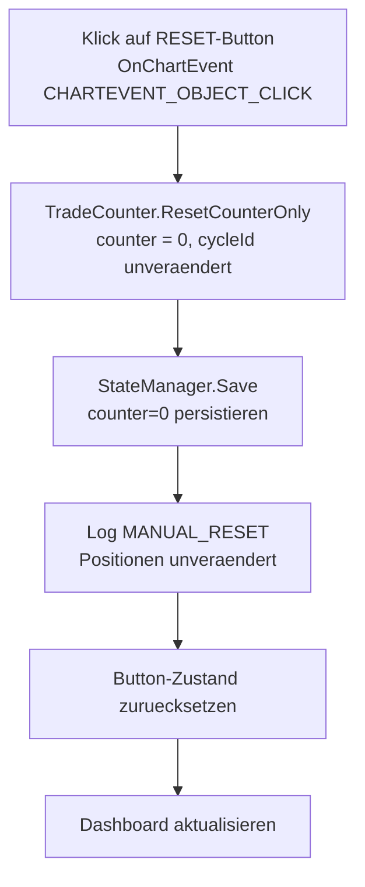
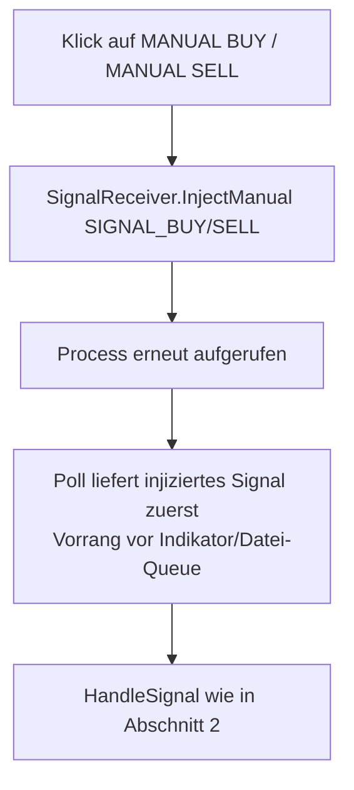
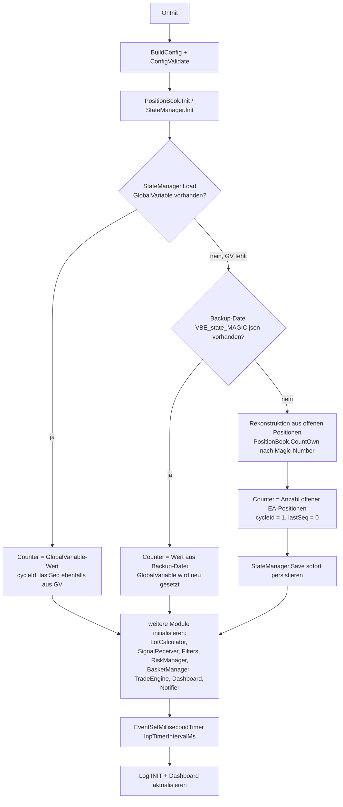

# Ablaufdiagramm – Vantage Basket EA

> Detailliertes Pendant zu [`ARCHITECTURE.md`](ARCHITECTURE.md) Abschnitt 4 (Datenfluss) und
> Abschnitt 5 (Zustandsmodell & Wiederherstellung). Modulnamen und Verantwortlichkeiten:
> [`ARCHITECTURE.md`](ARCHITECTURE.md) Abschnitt 3. Parameter: [`CONFIGURATION.md`](CONFIGURATION.md).

---

## 1. Haupt-Ablauf: `OnTick()` / `OnTimer()`

Beide Event-Handler rufen dieselbe zentrale, durch eine Re-Entrancy-Sperre (`g_busy`)
serialisierte Funktion `Process()` auf. Dadurch ist es unerheblich, ob ein neuer Kurs-Tick
oder der Timer (`InpTimerIntervalMs`) die Verarbeitung auslöst.

---

## 2. Signalverarbeitung: `HandleSignal()`

Die Filterreihenfolge (Spread → ATR → Zeit → Tag → Trend → News) entspricht exakt
`CFilters::Allow()` — der erste blockierende Filter liefert den Grund, alle nachfolgenden
Filter werden für dieses Signal nicht mehr geprüft.

**Wichtig:** Ein Buy-Signal führt immer zu einer neuen Buy-Position, ein Sell-Signal immer zu
einer neuen Sell-Position. Es gibt in `HandleSignal()` keinen Code-Pfad, der eine bestehende
Position aufgrund eines Gegensignals schließt oder nettet — das ist auf einem Hedging-Konto
auch technisch gar nicht vorgesehen.

---

## 3. Basket-Close: `CloseBasket()`

Wird ausgelöst durch Basket-TP, Basket-SL, Equity-Schutz **oder** den manuellen
„CLOSE ALL“-Button — in allen vier Fällen läuft derselbe Code-Pfad:

Auslöser im Überblick:

| Reason | Ausgelöst durch | Counter-Reset? |
|---|---|---|
| `CLOSE_TP` | `BasketManager.Check()`: Floating P/L ≥ TP-Schwelle | Ja, wenn `InpResetAfterBasketClose = true` |
| `CLOSE_SL` | `BasketManager.Check()`: Floating P/L ≤ -SL-Schwelle | Ja, wenn `InpResetAfterBasketClose = true` |
| `CLOSE_EQUITY` | `RiskManager.EquityBreached()` | **Immer ja**, unabhängig von `InpResetAfterBasketClose` |
| `CLOSE_MANUAL` | Dashboard-Button „CLOSE ALL“ | Nein — der Counter wird durch den Close-All-Button **nicht** zurückgesetzt (nur `CloseBasket` selbst; ein separater Reset erfolgt nur über den RESET-Button, siehe Abschnitt 4) |

---

## 4. Reset-Button-Flow (`BTN_RESET`)

Der manuelle Reset ist bewusst von `CloseBasket()` getrennt: Er verändert **ausschließlich**
den Zähler, niemals offene Positionen.

Nach einem RESET-Klick nutzt der **nächste** eröffnete Trade wieder `InpStartLot` — alle zu
diesem Zeitpunkt offenen Positionen bleiben exakt wie sie sind und werden weiterhin nur durch
Basket-TP/SL, Equity-Schutz oder den CLOSE-ALL-Button geschlossen.

---

## 5. Manuelle Test-Buttons (`BTN_BUY` / `BTN_SELL`)

Nur sichtbar, wenn `InpSignalSource = SRC_MANUAL` (bzw. für Debug-Zwecke). Ein Klick injiziert
ein synthetisches Signal, das denselben Weg wie ein reguläres Signal durchläuft (Filter,
Risk-Gates, Lotberechnung):

---

## 6. Neustart / Zustandswiederherstellung (`OnInit`)

Deckt sich mit [`ARCHITECTURE.md`](ARCHITECTURE.md) Abschnitt 5. Reihenfolge in `RestoreState()`:

Die Signal-Dedup-Historie (`lastSeq` für `SRC_FILE_QUEUE`) wird auf demselben Weg persistiert
und wiederhergestellt, sodass ein Neustart kein bereits verarbeitetes Datei-Queue-Signal
erneut ausführt.

---

## 7. Zusammenfassung: Prioritäten pro Zyklus

Innerhalb eines einzelnen `Process()`-Durchlaufs gilt strikt folgende Reihenfolge — jeder
frühere Schritt kann den Rest des Durchlaufs abbrechen (`return`):

1. **Equity-Schutz** (höchste Priorität — schützt das Konto unabhängig von allem anderen)
2. **Basket-TP/SL** (schließt den kompletten Basket bei Zielerreichung)
3. **Signalverarbeitung** (nur wenn Handel nicht angehalten ist: Filter → Risk-Gates → Order → Counter/State)
4. **Dashboard-Aktualisierung** (immer am Ende, sofern `InpShowDashboard = true`)

Diese Reihenfolge stellt sicher, dass niemals ein neues Signal verarbeitet wird, während
gleichzeitig ein Kontoschutz- oder Basket-Close-Ereignis ansteht.
